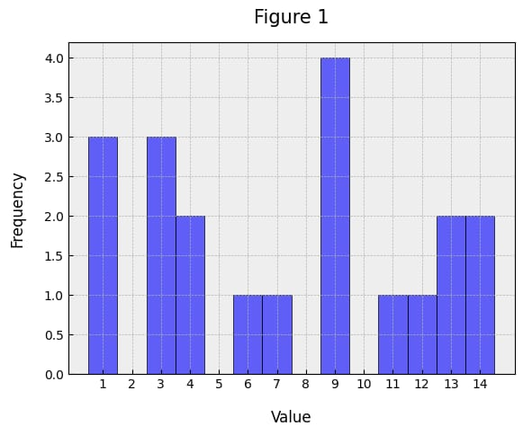
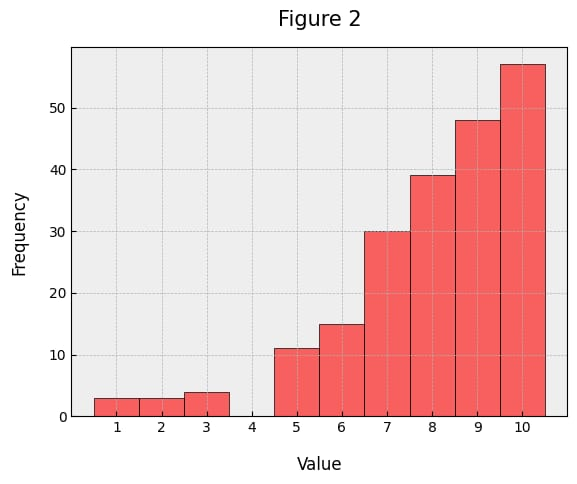

# Question 1

### 1. Mean, Median, and Mode

- **Mean**: is the summing all values and dividing by the number of them.
  - **Example**:  the mean salary of employees helps  understanding the overall payroll expense.
- **Median**: The middle value of a dataset when arranged in order. 
  - **Example**: When evaluating house prices to represent central tendency if some houses are extremely expensive.
- **Mode**: The most repeated value in a dataset.
  - **Example**: the mode of product is sold most in the shop.

---

### 2. Variance and Standard Deviation

- **Variance**: Measures the average squared deviation of each data point from the mean.
- **Standard Deviation**: The square root of the variance.
  
---

### 3. Left and Right Skewness

- **Left Skewness (Negative Skew)**:
  - Tail is longer on the left side.
  - Order: Mean < Median < Mode.
- **Right Skewness (Positive Skew)**:
  - Tail is longer on the right side.
  - Order: Mode < Median < Mean.

---

### 4. Outliers

- : Data points that are significantly different from the majority of the data.
  
  - **Real-world Example**: when i get 95% and the degrees of most student are between 40% and 60% .

---

### 5. Population vs. Sample

- **Population**: Entire set of data points or subjects of interest.
  - **Example**: All students in a university.
- **Sample**: A subset of the population used to make inferences about the population.
  - **Example**: 50 students selected randomly from a university.
- **Measurements**:
  - both of them has the same Measurements for Mean, median, and mode .

---

### 6. Discrete vs. Continuous Random Variables

- **Discrete**: takes specific, countable values.
  - **Example**: Number of cars sold  in a day.
- **Continuous**: Can take any value within a range.
  - **Example**: Weight of a randomly selected apple.

---

### 7. Probability Mass Function vs. Probability Density Function 

- **Mass**:
  - used for discrete random variables.
  - gives the probability of a random variable being exactly equal to a specific value.
  - the sum of probabilties for all values is 1
- **Density**:
  - Used for continuous random variables.
  - the probability for a range = the integral or the aria under the curve

---

### 8. Normal Distribution and Standard Deviations


- The empirical rule states that:

  - virtually all observed data will fall within three standard deviations of the mean.
  - Under this rule:
       - 68% of the data will fall within one standard deviation,
       - 95% within two standard deviations, 
       - and 99.7% within three standard deviations .
  

# Question 2


### Tasks:
1. Estimate the following for the given sample:
   - Mean
   - Median
   - Mode
   - Variance
   - Standard Deviation
2. Demonstrate how the results will differ if the data is considered as a whole population.
---
### Solution with Steps:

#### (a) Mean:


\[ Mean = {(1 * 3) + (3 * 3 ) + (4 * 2 ) + (6 * 1) + (7 * 1) +
           (9 * 4) + (11 * 1) + (12 * 1) + (13 *2) + (14 *2)}
             /
           ( 3 + 3 + 2 + 1 + 1 + 4 + 1 + 1 + 2 + 2) = 7.3 \]
---
#### (b) Median:
values: \[ 1 , 3 , 4 , 6 , \[ 7 , 9 \], 11 , 12 , ,13 , 14 \]
median = ( 7 + 9) / 2 = 8
---
#### (c) Mode:
The mode is the value that appears most frequently = \[ 9 \].
---
#### (d) Variance for a Sample:

 
 \[Variance = 20.01 \]
---

#### (e) Standard Deviation for a Sample:
The standard deviation is the square root of the variance:


\[sqrt(20.01) = 4.473\]

---
### 4. Population Metrics:
If the data represents the whole population:

#### (a) Variance for Population:
The formula changes to:


\[Variance = 9.345\]

#### (b) Standard Deviation for Population:


\[sqrt(9.345) = 3.057\]
---


# Question 3



### Task:
1. Analyze the distribution of this sample.
2. Explain how the distribution affects the mean, median, and mode.

**Note:** No calculations are required. Base your answer on the visual distribution.

---

## Solution:

The distribution shown in the histogram appears to be **positively skewed** (right-skewed), as the frequency increases as the value progresses, and then it drops off sharply at the higher end.

### Implications on Mean, Median, and Mode:
1. **Mean:** The mean is likely to be **pulled towards the higher values** due to the skewness (influence of the larger values on the average).
2. **Median:** The median will lie **between the mode and the mean**, as it is less affected by extreme values.
3. **Mode:** The mode will be the **most frequent lower value** as it represents the peak of the distribution.

---

# Question 4

### 1. What do you know about Python's containers?
Python provides several container types:
- **List**: Ordered and mutable collection of elements. Example: `[1, 2, 3]`
- **Tuple**: Ordered but immutable collection. Example: `(1, 2, 3)`
- **Set**: Unordered collection with unique elements. Example: `{1, 2, 3}`
- **Dictionary**: Key-value pairs. Example: `{'a': 1, 'b': 2}`

### 2. What does `apply()` method do?
The `apply()` method is commonly used in pandas. It allows applying a function to rows or columns of a DataFrame. For example:
```python
import pandas as pd

df = pd.DataFrame({'A': [1, 2, 3]})
df['B'] = df['A'].apply(lambda x: x**2)
print(df)
```

### 3. How would you reverse a list in Python in one line (Don't use `reverse()` method)?
You can reverse a list using slicing:
```python
reversed_list = my_list[::-1]
```

### 4. Compare between `continue`, `break`, and `pass`.
- **`continue`**: Skips the current iteration of the loop.
- **`break`**: Exits the loop immediately.
- **`pass`**: Does nothing, used as a placeholder.

### 5. What is the output of this code?
```python
a = [1, 2, 3, 4, 5]
b = a
b[0] = -11
print(a)
```
Output: `[-11, 2, 3, 4, 5]`
Explanation: `b` is a reference to the same list as `a`.

### 6. What is the output of this function?
```python
def print_list(lst=[]):
    lst.append(1)
    print(lst, end=" ")

print_list()
print_list()
print_list()
```
Output: `[1] [1, 1] [1, 1, 1]`
Explanation: The default list is mutable and shared between calls.

### 7. What do you know about Object-Oriented Programming (OOP)?
OOP is a paradigm based on the concept of "objects" which bundle data and methods. Key principles include:
- **Encapsulation**
- **Inheritance**
- **Polymorphism**
- **Abstraction**

### 8. What do you know about Functional Programming?
Functional Programming emphasizes using functions and immutable data. Key concepts:
- **First-class functions**
- **Higher-order functions**
- **Pure functions**
- **Recursion**

---

# Problem Solving

## Question 1


### Solution:

```python
def minRublesSpent(n, m, a, b):
   return (n // m) * b + min(b, (n % m) * a)


n, m, a, b = map(int, input().split())  
print(minRublesSpent(n, m, a, b)) 
```

## bouns Question 


### Solution:

```python
def isCanDistribute(a,b,c,n):
    coinsPerOne = a+b+c+n
    if (coinsPerOne) %3 ==0 and  coinsPerOne >= max(a,b,c):
            return "YES"
    else:
        return "NO"
        

t = int(input())
while(t):
    a,b,c,n = map(int, input().split())
    print(isCanDistribute(a,b,c,n))
    t = t-1
```
